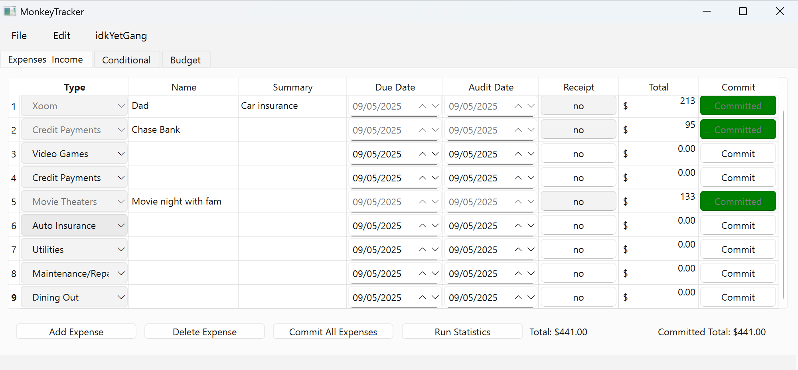
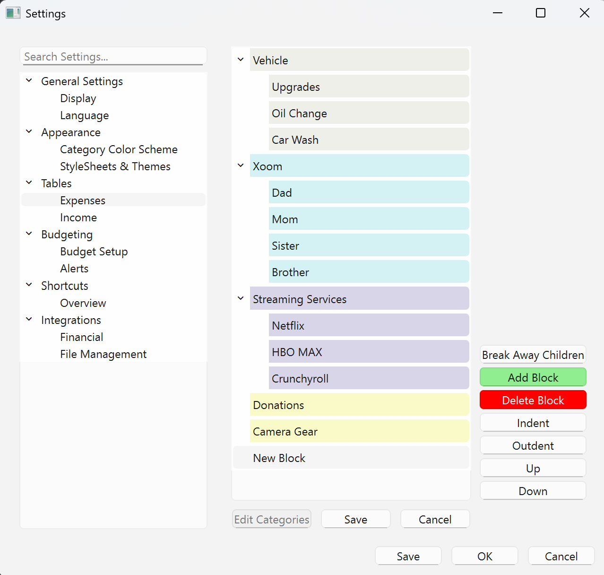

# 🐒PyQT6: Transactions Manger🐒
**Feel free to contribute!**

Old 2022 Project back from the grave codebase isn't the cleanest or very readable
(not even god remembers what I wrote 3 years ago). I changed the structure and file
naming conventions this is a re-upload repo made public, any changes you wish to contribute go head!

## Plan (may or may not be in order):
- Full codebase restructure
- Naming conventions change
- Excel copycat shortcuts
- Dark, Light, Acrylic QSS themes.
- CSV & Excel imports
- Integration with **Plaid API**
- JSON GUI category editors
- **BUDGETING** (this is its own beast, more on it later)

---

## 🌟 Features (WIP)
Chef, give me a few more days, don’t fire me yet. using PyQT6, Pandas, and I have yet to decide which package I'll use
for graph displays.

